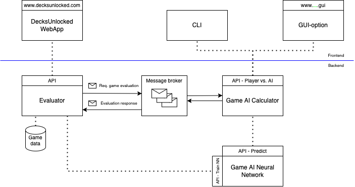

# Introduction
The aim of DecksUnlocked is to build a game playing AI for Trading Card Games (TCG)s. The goal is to build an AI that supports the following two scenarios:

1. A person plays agains the AI.
2. The AI plays against istelf.

Point 2 provides a valuable tool for deckbuilding and assessing a deck's strength. Letting the AI play numerous games against itself will generate valuable statistics such as an estimated winrate, performance of individual cards, as well card synergies.

The ultimate goal of the project is to provide a webapp platform that provides features such as statistical insights on decks and cards based on the AI's simulations. Additionally, players will be able to upload their own decks and request an assesment. The AI will then perform simulations and provide the insights to the players.

# Architecture
The system's architecture consists of distributed micro-sevices. The architecture itself is agnostic to any specific game, any service that requires the game's rules will import libraries containing the rules.

## Frontend
The frontend consists of two parts, the webapp allowing players to obtain insights of simulated games, and interfaces that allow players to play directly with the AI.

## Backend

### AI Calculator
This microservice is the gameplaying engine that a player or the Evaluator can interact with. It performs Monte Carlo Tree Search (MCTS) to find the best move for a particular game-state. It's computation is CPU heavy.

### AI Neural Network
This microservice contains a Neural Network that is used to guide the AI Calculator to find the best move faster. The neural network is trained with Stochastical Gradient Descent by Evaluator. It's computation is GPU/TPU heavy.

### Evaluator
The evaluator's purpose is to request evaluations of games and store it's results for later lookups. Additionally, the Evaluator feeds the AI Neural Network with previous evaluations to train its neural network. The Evaluator thus also acts as the system's feedback loop required for the AI to improve its play strength.

# Algorithms
TODO MCTS, NN lookups